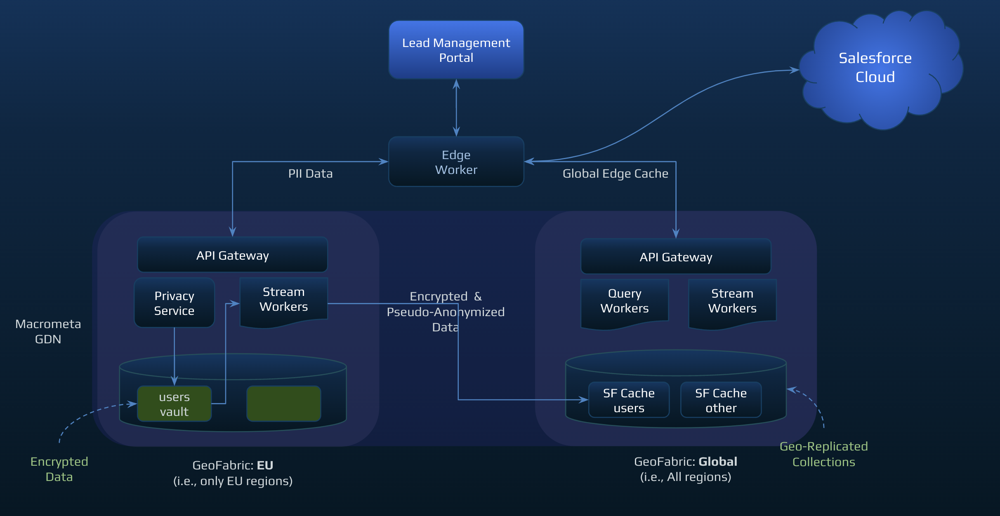

# Demo PII

### Live Demo: https://sf-pii.macrometa.io/

Macrometa Salesforce PII Demo app is a fullstack admin/user portal that showcases the edge caching and data privacy capabilities of GDN for Salesforce. Two fabrics are created on the GDN platform. The first fabric is deployed in the European region (datacenters are located in Europe) and the second fabric is deployed globally (all datacenters including European region). When a user is added via the UI and the user is from a European country, his contact information is encrypted by the privacy service and stored in the European fabric. Then, with the help of a stream worker, these encrypted fields are pseudo-anonymized and added to a collection in the global fabric. The admin can perform CRUD operations on this record. The admin can use the "shared" command to send a curl command to the user which allows him to see the the details of his records (unencrypted).The admin can then do the bulk upload to load the data to salesforce lead section. 


## Setup

| **Federation**                                        | **Email**                              | **Passsword** |
| ----------------------------------------------------- | -------------------------------------- | ------------- |
| [Global Data Network](https://gdn.paas.macrometa.io/) | demo@macrometa.io | `dexxxxxxx`    |

| **Salesforce Web Console URL**                                        | **Email**                              | **Passsword** |
| ----------------------------------------------------- | -------------------------------------- | ------------- |
| [Salesforce web console](https://macrometa-dev-ed.lightning.force.com/) | salesforce@macrometa.com | `Welxxxxx3!`    |

## Overview

**Dashboard:**

The dashboard is built using Remix which is a full stack web framework that lets you focus on the user interface and work back through web fundamentals to deliver a fast, slick, and resilient user experience that deploys to any Node. js server and even non-Node. js environments at the edge like Cloudflare Workers.
The dashboard consists of admin workflow the user workflow. In the admin flow the user logins in as an admin . The admin is able to select a region from the list of available GDN regions. If the admin selects an eu region he is able to see all the pseudo-anonymized data as well as the data added to the non-eu region. Also in the eu region you are able to Share (if the data is encrypted and anonymized, curl command is provided that can be shared via text message or copied to clipboard), Edit, Delete, and Decrypt (if the record is encrypted and anonymized) the record.The admin can then do a bulk upload of lead data to the salesforce.
The user flow is where a user logs in using his decrypted email address and sees his details and is able to share (if encrypted and anonymized), edit and forget.

**Admin Screen**


**User Login**


### Macrometa GDN setup

## STREAM WORKERS

1. Create and publish the following Stream Workers in your federation:

    Refer to the following links to add content for each Stream worker:

    * **[DataAnonymizerSalesforce](stream-apps/DataAnonymizerSalesforce.md)**
    * **[DataAnonymizerSalesforceUpdate](stream-apps/DataAnonymizerSalesforceUpdate.md)**

2. Create the following Queries  in your federation:

    **GetUsers**

    ```js
    FOR doc IN users RETURN doc,
    ```

    **GetUserLeadInfo**

    ```js
    FOR doc in user_lead_info RETURN doc
    ```

    **GetUserConsents**

    ```js
    FOR doc in user_consent_data RETURN doc
    ```

    **InsertUser**

    ```js
    INSERT { _key: @token, token: @token, name: @name, email: @email, phone: @phone,firstName:@firstName, lastname:@lastname } INTO users
    ```

    **UpdateUser**

    ```js
   FOR user IN users UPDATE { _key: @token, ${updateWhat} } IN users
    ```

    **InsertLocation**

    ```js
      INSERT { _key: @token, token: @token, state: @state, country: @country, zipcode: @zipcode, job_title: @job_title } INTO user_lead_info
    ```

    **UpdateUserLeadInfo**

    ```js
    UPDATE @_key with {"value": @value } IN user_lead_info
    ```

    **SearchUserByEmail**

    ```js
    FOR user IN users FILTER user.email == @email RETURN user
    ```

    **SearchConsentByToken**

    ```js
    FOR user IN user_consent_data FILTER user._key == @token RETURN user
    ```

    **SearchLocationByToken**

    ```js
    FOR doc in user_lead_info 
    filter doc.value[*].token ANY == @token
    RETURN {
      "Id": doc.value[0].Id,
      "Name": doc.value[0].Name,
      "FirstName": doc.value[0].FirstName,
      "LastName": doc.value[0].LastName,
      "Title": doc.value[0].Title,
      "Company": doc.value[0].Company,
      "Street": doc.value[0].Street,
      "City": doc.value[0].City,
      "State": doc.value[0].State,
      "PostalCode": doc.value[0].PostalCode,
      "Country": doc.value[0].Country,
      "Phone": doc.value[0].Phone,
      "Email": doc.value[0].Email,
      "Website": doc.value[0].Website,
      "LeadSource": doc.value[0].LeadSource,
      "Status": doc.value[0].Status,
      "Industry": doc.value[0].Industry,
      "Rating": doc.value[0].Rating,
      "IsUnreadByOwner": doc.value[0].IsUnreadByOwner,
      "NumberOfEmployees": doc.value[0].NumberOfEmployees,
      "token": doc.value[0].token,
      "isUploaded": doc.value[0].isUploaded,
      "_key": doc._key
    ```

    **DeleteUser**

    ```js
    REMOVE { _key: @token } IN users
    ```

    **DeleteUserLeadInfo**

    ```js
    REMOVE { _key: @token } IN user_lead_info
    ```

    **DeleteConsentInfo**

    ```js
    REMOVE { _key: @token } IN user_consent_data
    ```

    **SalesforceLeadQuery**

    ```js
    SELECT id,salutation,name,firstname,lastname,title,company,street,city,state,postalCode,country,phone,email,website,leadsource,status,industry,rating,IsUnreadByOwner,NumberOfEmployees,description FROM lead
    ```

    **InsertUserConsent**

    ```js
    UPSERT {_key:@token}
    INSERT { _key: @token, ConsentRequested: @ConsentRequested }
    UPDATE {ConsentRequested:@ConsentRequested} IN user_consent_data
    ```

    **TruncateGlobalCollections**

    ```js
    let a = (FOR user IN users REMOVE user IN users)
     let b = (FOR lead IN user_lead_info REMOVE lead IN user_lead_info)
     let c = (FOR consent IN user_consent_data REMOVE consent IN user_consent_data)
     return {a,b,c}
    ```

     **TruncateEuCollections**

    ```js
    FOR user IN pii_users REMOVE user IN pii_users
    ```

3. Create the following collections in your federation:

    | **Collection**     | **Fabric**                              |     **UserCreated**   |
    | ----------------   | ------------------------------------    |-----------------------|
    | users              |  `pii_global_sf`                        |     YES               |
    | user_lead_info     |  `pii_global_sf`                        |     YES               |
    | user_consent_data  |  `pii_global_sf`                        |     YES               |

4. On the development machine, run the following commands in a console:

    ```
    1. git clone git@github.com:Macrometacorp/demo-salesforce-pii
    2. cd demo-salesforce-pii
    3. git fetch
    4. npm install
    5. npm run dev (to start the UI)
    6. npm start (to start the miniflare)
    ```

# Project setup

## Privacy Service Setup

```
In the demo-salesforce-pii repo
1. cd demo-salesforce-pii/privacyservice
2. Change the following three variables in the initdb.sh file:
   a. MMURL=<GDN REST API url to the European fabric>
   b. MMAPIKEY=<The GDN API KEY>
   c. MMFABRIC=<The European fabric name>
   d. DATABUNKER_MASTER=<the master encryption key>
   e. DATABUNKER_ROOTTOKEN<the root token>

   DATABUNKER_MASTER can be generated using this command:
      < /dev/urandom LC_CTYPE=C tr -dc 'a-f0-9' | head -c${1:-48}
   DATABIMLER_ROOTTOKEN can be generated using this command:
      uuidgen
3. Execute the initdb.sh script (this creates all the collections in the European fabric)
4. Edit the Dockerfile and change the following environment variables with the variables created in step #2
   a. DATABUNKER_MASTER
   b. MMURL
   c. MMAPIKEY
   d. MMFABRIC
5. Build the docker image:
   docker build -t demo-pii .
6. Start the privacy service docker image:
   docker run -d --restart on-failure -p 3000:3000 demo-pii
```

## Setup Twilio for text message

1. Open Twilio account: https://www.twilio.com/try-twilio and signup
2. Verify the email address.
3. Add the phone number and verify the same by typing the otp sent to that number.
4. Complete the remaining form and which will be redirected to login page.
5. This will get a trial account with $15(which you can later update) from which can be used to buy a phone number.
6. This phone number will be used to send messages.
7. Also you have to provide geo permissions in order to send message to that regions.
8. After successfull sign up you will get `ACCOUNT SID` and `AUTH TOKEN` which is to be used to send message programmatically.
9. Visit this link for more information https://www.twilio.com/docs/sms/send-messages
 
## Installing workers CLI

There are multiple ways to install the workers CLI. Official docs say it to install via [npm](https://developers.cloudflare.com/workers/learning/getting-started#2-install-the-workers-cli) or [cargo](https://github.com/cloudflare/wrangler#install-with-cargo).
Additionally the binary can also be installed manually. Details of which can be found [here](https://developer.aliyun.com/mirror/npm/package/@granjef3/wrangler) under the `Manual Install` section - I personally have the binaries.

It is advisable to have `npm` installed via `nvm` to avoid getting into issues when installing global packages. Additional details can be found in their [github repo](https://github.com/cloudflare/wrangler#install-with-npm).

## Configuring the project for deployment

### Obtaining your API token

We will need the Macrometa API token to be able to configure the CLI. Please signup for a macrometa account for the token, or create your own by following the docs if you already have an account [here](https://developers.cloudflare.com/workers/learning/getting-started#6b-obtaining-your-api-token-or-global-api-key)

### Configuring Wrangler with your credentials

Run `wrangler config` and enter the above API token when asked for. More details can be found [here](https://developers.cloudflare.com/workers/learning/getting-started#6c-configuring-wrangler-with-your-credentials)

## Configuring your project

`wrangler.toml` already has the configurations.
Please provide details for the below ones before proceeding
```
FEDERATION_URL=xxxx
PRIVACY_SERVICE_URL=xxxx
DATABUNKER_ROOTTOKEN=xxxxx
TWILIO_ACCOUNT_SID=xxxxx
TWILIO_AUTH_TOKEN=xxxx
TWILIO_MESSAGE_ENDPOINT=xxxx
TWILIO_NUMBER=xxxx
MM_API_KEY=xxxx
SALESFORCE_INSTANCE_URL = xxxx
SALESFORCE_INSTANCE_SUB_URL = xxxx
SALESFORCE_JOB_INGEST = xxxx
SALESFORCE_CLIENT_ID = xxxx
SALESFORCE_CLIENT_SECRET = xxxx
SALESFORCE_USERNAME = xxxx
SALESFORCE_PASSWORD = xxxx
SALESFORCE_LOGIN_URL = xxxx
```

## Publishing your project

Make sure to run `npm i` on the project's root to install the necessary dependencies.

## Building the UI

If there are changes to the UI code then first run `npm run dev` to make the UI build, else you can directly proceed with publishing.

## Publishing

Run `wrangler publish` and it will deploy your worker along with the static files used by the UI.
